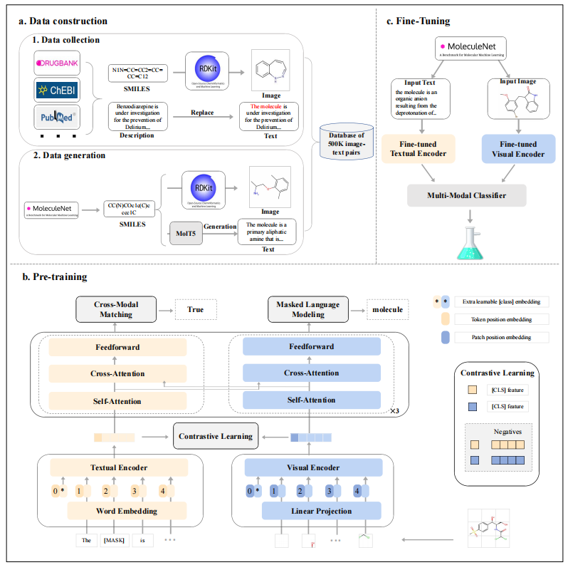

# ITMol
##### A Multimodal Foundation Model for Molecular Property Prediction via Image-Text Pre-training
  - [Overview](#overview)
  - [Introduction](#installation)
  - [Dataset](#description-of-data-files)
  - [Usage](#Usage)
  - [Citation](#citation)
## Overview

The overview of the proposed ITMol model. (a) The data construction phase results in a dataset of 500k molecular image-text pairs.
(b) The pre-training phase aligns text and image modalities. (c) The fine-tuning phase predicts molecular properties.
